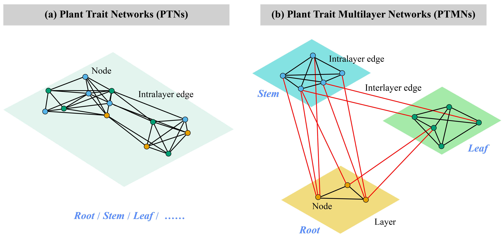

# PTMN

PTMN is an R package designed for constructing, visualizing, and analyzing Plant Trait Multilayer Networks (PTMNs). PTMNs integrate plant functional trait data across multiple organs or systems into a unified multilayer framework, enabling researchers to capture both intralayer and interlayer interactions with high ecological relevance. The package supports the collection of multilayer trait data, correlation-based edge filtering, and network assembly into extended edge lists for analysis. It provides functions to compute key topological parameters such as interlayer edge density, clustering, and path lengths, helping identify hub traits and cross-layer functional modules. By revealing complex trait coordination in plants, PTMN offers a robust tool for exploring plant adaptation strategies and predicting biodiversity dynamics under environmental change.



## Installation

```{r,class.source = 'fold-show'}
if (!requireNamespace("devtools", quietly = TRUE)) {install.packages("devtools")}
devtools::install_github("biodiversity-monitoring/PTMN")
```

## Main Functions

| Function         | Description                                                                                                                                                                                                                                                                                                                      |
|----------------|--------------------------------------------------|
| `PTMN()`         | Constructs a phylogenetic trait multilayer network where nodes represent traits organized into layers (e.g., organs or functional systems) and edges represent significant correlations. Supports correlation thresholding, p-value filtering, FDR correction, and optional phylogenetic correction using independent contrasts. |
| `PTMN_metrics()` | Calculates node-level and global network metrics for PTMNs, identifying hub traits and cross-layer modules. Metrics include interlayer degree, closeness, clustering coefficient, edge density, path length, and modular association.                                                                                            |
| `PTMN_plot()`    | Visualizes PTMNs with options for standard and circular layouts, customizable node and edge aesthetics, and layer/module highlighting. Differentiates intralayer edges (black) from interlayer edges (red).                                                                                                                      |

## Example

```{r,class.source = 'fold-show'}
library(PTMN)
data(forest_invader_tree)
data(forest_invader_traits)
traits <- forest_invader_traits[, 6:73]
layers <- list(
  shoot_dynamics = c("LeafDuration", "LeafFall50", "LeafRate_max",
                     "Chl_shade50", "LAgain", "FallDuration",
                     "LeafOut", "Chl_sun50", "EmergeDuration",
                     "LeafTurnover"),
  leaf_structure = c("PA_leaf", "Mass_leaf", "Lifespan_leaf",
                     "Thick_leaf", "SLA", "Lobe", "LDMC",
                     "Stomate_size", "Stomate_index"),
  leaf_metabolism = c("J_max", "Vc_max", "Asat_area", "CC_mass",
                      "LSP", "AQY", "CC_area", "Rd_area",
                      "Asat_mass", "WUE", "Rd_mass", "PNUE"),
  leaf_chemistry = c("N_area", "Chl_area", "DNA", "Phenolics",
                     "Cellulose", "N_mass", "N_litter", "Chl_ab",
                     "Chl_mass", "N_res", "C_litter", "C_area",
                     "C_mass", "Ash", "Lignin", "Solubles",
                     "Decomp_leaf", "Hemi"),
  root = c("NPP_root", "SS_root", "SRL", "RTD", "RDMC",
           "NSC_root", "Decomp_root", "Starch_root",
           "C_root", "N_root", "Lignin_root"),
  stem = c("Latewood_diam", "Metaxylem_diam", "Earlywood_diam",
           "NSC_stem", "Vessel_freq", "SS_stem", "Cond_stem",
           "Starch_stem")
)
graph <- PTMN(traits, layers_list = layers, method = "pearson", phylo_correction = TRUE, phylo_tree = forest_invader_tree)
PTMN_metrics(graph)
PTMN_plot(graph, style = "default", vertex_size = 8,
          vertex_label_cex = 0.5, edge_width = 2,
          show_legend = TRUE)
```
